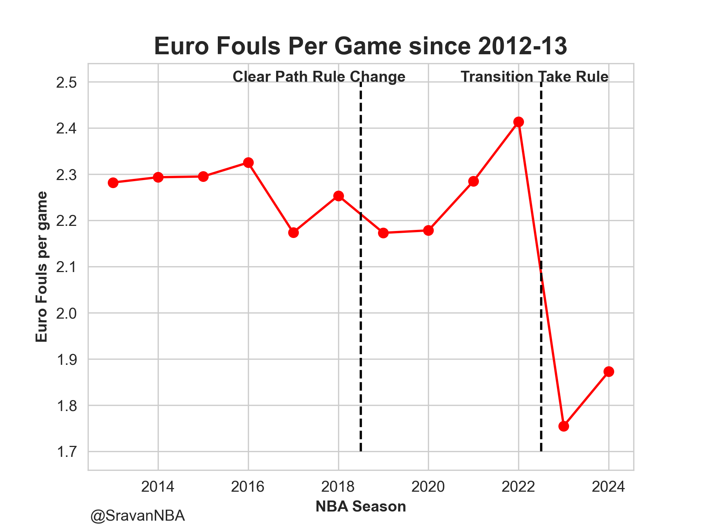
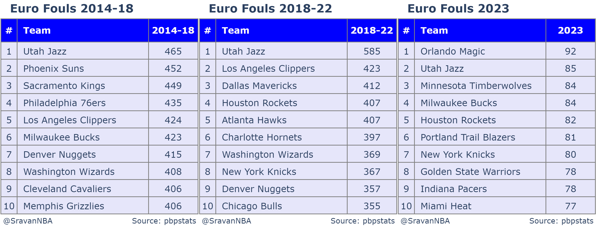

+++
title = "Have the New NBA Rule Changes Reduced Euro Fouls in the NBA: Foul Analysis I"
date = "2023-11-29"
description = "Using play-by-play data to filter possessions and estimate Euro (Transition Take) fouls"

[taxonomies]
tags = ["play-by-play","fouls"]
categories = ["NBA"]
[extra]
toc = true
keywords = "NBA, Analytics, Euro Foul, Transition Foul, Take Foul, play-by-play, Fastbreaks"
+++

This blog is an update to my [first](https://medium.com/basketballobservations/frustration-fouls-in-the-nba-4fed20ca0075) and [second](https://medium.com/basketballobservations/euro-fouls-in-the-nba-c8d8cee7a3a8) blogs written almost three years ago. As mentioned in [my previous post](https://blog.sradjoker.cc/posts/nba-sosadj/), these posts were when I was new to NBA analytics and python coding, and even blogging. Updating them would hopefully convey my ideas better. Another reason for updating the post is to move it to my current blog, which is completely written on my computer and deployed automatically using github through cloudflare pages. You can actually find my blog on [github](https://github.com/sravanpannala/blog). It is written in markdown and the webpages are created using [zola](https://www.getzola.org/), giving me a fast and slick way for customizing the blog to my needs, instead of me confirming to Medium's workflow. 

## Introduction
Fastbreaks in basketball are fun, right? They produce highlight-reel dunks, posters, alley-oops, special passes, and more. It is breathtaking to see tall humans flying up the court with the ball and pulling out spectacular moves. Fastbreaks or transition basketball are also the most efficient way to score the basketball. On average, teams score more than [1.11 PPP](https://www.nba.com/stats/teams/transition?SeasonYear=2023-24&SeasonType=Regular+Season&sort=PPP&dir=1) (points per possession) in transition. So, what are defenses doing to counter this super-efficient type of offense? They are fouling intentionally early in the possession to stop the fastbreaks from even happening, i.e., nipping them in the bud.

{{ youtube(id="Mo907oFXa-w") }}
<p style="text-align: center;">Here you see the Jazz Euro-fouling Kevin Durant to stop the fastbreak</p>


This intentional foul is called a Euro-foul. They are named that way because the Euro-foul originated from the European game. The NBA calls Euro fouls as transition take fouls and defines them as:
> An intentional foul committed by a defender to deprive the offensive team of a fast-break opportunity

The NBA tried to [curb Euro-fouls by making changes](https://official.nba.com/example-of-clear-path-rule-simplifications/) to the [clear-path rule](https://www.washingtonpost.com/news/sports/wp/2018/08/27/the-nba-is-trying-to-speed-up-the-game-again-thats-good-for-the-league-and-for-fans/) in 2018, but it didn’t fix the issue. 
The NBA has tried to address the issue again by introducing [transition take foul rule](https://www.nba.com/news/nba-board-of-governors-approves-heightened-penalty-for-transition-take-foul) at the start of 2022-23 season by increasing the [penalty for transition take foul](https://www.sportingnews.com/us/nba/news/take-foul-transition-rule-penalties-clear-path-nba/wmsl3amguhycebagau4mmd5i) in addition to the existing clear-path rule.
Before the NBA changed the rule in 2022, the penalty for a take foul was a common foul for a defender and a side out for the offensive team. Now, in addition to the previous penalties, the offensive team is awarded one free throw, which can be taken by any player on that team. This new rule change, almost guarantees 1 point on the possession. 

This article will quantify Euro fouls prior to the 2018 rule clear path rule change, between 2018-2022 and finally after the 2022 transition take foul rule change. Then, we can see if the rule changes regarding Euro fouls are effective or not.


## Euro foul Estimation
### Definition
Let’s first get the nitty-gritty stuff out of the way. To write an algorithm for estimating Euro fouls, I have a come up with a definition of Euro foul, which can be coded:

>A Euro-foul is one committed by a player within 5 seconds of his team committing a turnover or missing a shot.

### Algorithm
To estimate Euro fouls using the above definition, I used [Darryl Blackport’s](https://twitter.com/bballport) [pbpstats API](https://pbpstats.readthedocs.io/en/latest/). It allows getting details of what happens in each possession for all the games in an NBA season. We can identify if a foul happens on the possession and if the previous possession ends in a missed shot or a turnover. We can then filter for situations when the foul occurs within 5 seconds of the previous possession and if the previous possession was a missed shot/turnover by the team. A similar algorithm can also be done to calculate the number of Euro-fouls, and this analysis will be a part of a future article. Here is the code implemented in python to filter the necessary possessions:

```python
if isinstance(possession_event, Foul) and 
    (isinstance(possession_event.previous_event, Turnover) or not (possession_event.previous_event, FieldGoal)) 
    and possession_event.seconds_since_previous_event <= 5:
    if possession_event.teamID == possession_event.previous_event.teamID:
        euro_possessions.append(possession_event)
```

As I get all the nerdy stuff out of the way, let us now look at the results.

## Euro-Fouls trends since 2012-13

To analyze the trends we need to estimate the total Euro fouls per season. This can be done easily by summing up all Euro fouls committed by all NBA teams. But, we can't use the total Euro fouls per season to compare trends across seasons because not all season lengths are same. Both the 2019-20 and 2020-21 season were shortened due to COVID. Also 2023-24 season is being played right now, so it wont have the usual 1230 games played during an NBA season. So, I normalize the total Euro fouls per season by dividing with number of games played during that season. This results in an interesting plot:

 

Euro fouls were consistently around the 2.3 PG (per game) number from 2012-2016. There was a negligible decrease in Euro fouls PG after the clear path rule changes in 2018. But the Euro fouls grew a lot in 2021 and 2022 seasons, reaching an all-time high on 2.4 PG during the 2021-22 season. This probably prompted the NBA to curb the Euro foul by introducing the transition take rule in 2022. As we can see in the figure, the rule change resulted in a drastic decrease in Euro fouls PG from 2.4 to 1.75 last season. This decrease has carried on to this season with Euro fouls PG being 1.9. Hence, the transition take foul rule change has been one of the most effective rule changes that the NBA has introduced to improve its quality of play.

## Euro-Foul Team Leaderboards for 2014-23
Now, we want to see whether there are some teams which consistently exploited the Euro fouls over the past 9 seasons.
Here is a table which shows total Euro fouls committed during two 4-year periods from 2014-18 and from 2018-22 and also last season 2022-23:



These are my observations:
- Utah Jazz consistently commit the most Euro fouls, ranking top 2 in all three leaderboards. Their propensity for Euro-fouling was especially evident in their playoff series against the Thunder in 2018, where they ground down the Thunder offense by repeatedly Euro-fouling Russell Westbrook to prevent him from doing his devastating forays in transition. You can read an excellent [article](https://www.normantranscript.com/oklahoma/jazz-trying-to-win-on-the-margins-by-euro-fouling-thunder/article_5e1ce470-44e8-11e8-a6a8-9f78181fe172.html) on this by [Fred Katz](http://twitter.com/FredKatz). Also, the Utah Jazz consistently ranked in the [top 3](https://www.nba.com/stats/teams/transition?sort=POSS_PCT&dir=-1&SeasonType=Regular+Season&TypeGrouping=defensive&SeasonYear=2018-19) in limiting transition opportunities from 2016-19. From 2019-22 they were ranked in the top 10. This changed due to the transition take rule change, they have been ranked in bottom 2 in 2022-23 and dead last in the current (2023-24) NBA season.
- Reams which rank in top 10 for both 2014-19 and 2018-22 are the Denver Nuggets, Los Angeles Clippers and Washington Wizards. Also, Jokic has a particular propensity of committing both Euro and Frustration fouls. This will be tackled in the sequel to this blog.
- Teams which rank in top 10 for both 2018-22 and 2022-23 are Houston Rockets and New York Knicks. 

From this data, I can infer that Euro-fouling is a coaching decision made by certain coaches to prevent fastbreaks. This is because the same teams show up in these lists multiple times. These coaches are willing to trade-off fouls with stopping fastbreak attacks, particularly when the other team has a superb transition attack or if they have a player who excels in transition.


## Conclusions
We have seen that Euro fouls were being exploited by NBA teams to prevent highly efficient transition plays and this problem was getting worse over time. NBA stepping in with the transition take foul rule change, which has been supremely effective in curbing Euro fouls. 

I'll release the Part II of my Foul Analysis series which would analyze frustration fouls sometime in the next few days. Be on a lookout for that blog. 

Thank you for reading and any feedback is appreciated. You can reach me on Twitter at [@SravanNBA](https://twitter.com/SravanNBA).